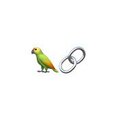
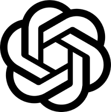

# SumMeAI - Text Summarization and Document Analysis

## I. Introduction
SumMeAI is a powerful application designed to simplify the process of text summarization and document analysis. With support for both Vietnamese and English texts, this application allows users to extract key information from a given text or uploaded files in various formats such as TXT and PDF.

## II. Features

### 1. Text Summarization
- SumMeAI utilizes advanced natural language processing techniques to generate concise summaries of lengthy texts. By extracting the most important sentences and preserving the context, users can quickly grasp the main ideas and key points of any document.

### 2. Multilingual Support
- SumMeAI supports both Vietnamese and English texts, enabling users to summarize documents written in either language. This makes the application versatile and accessible to a wider user base.

### 3. File Upload
- Users can easily upload TXT or PDF files directly into SumMeAI for summarization and analysis. Whether it's a research paper, an article, or a report, the application efficiently processes the content and provides valuable insights in a matter of seconds.

### 4. Virtual Assistant
- SumMeAI goes beyond text summarization by offering a virtual assistant that can answer questions related to the uploaded documents. Users can interact with the assistant and gain further understanding of the content, enabling a more comprehensive analysis.

## III. Technical Overview

